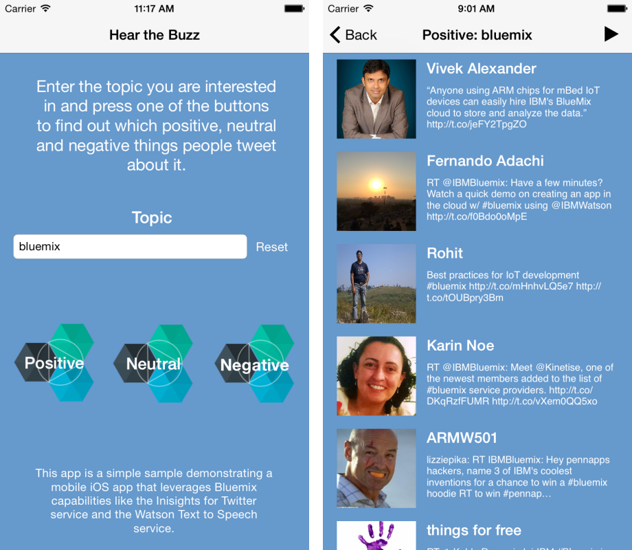
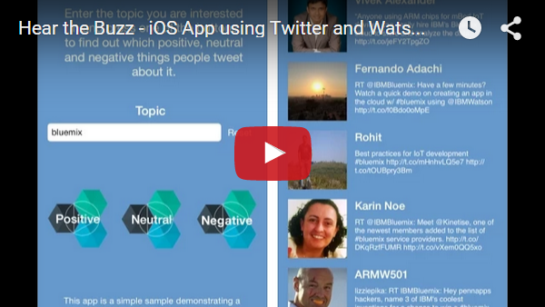
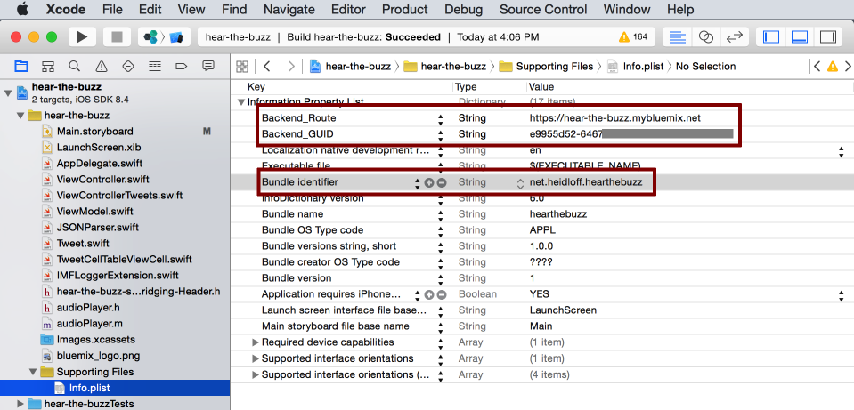

Hear the Buzz
================================================================================

The [hear-the-buzz](https://github.com/IBM-Bluemix/hear-the-buzz) project contains a sample iPhone app which finds tweets with positive or negative sentiments for topics which users enter manually or via iOS speech recognition. After this users can read these tweets or listen to them. On Apple Watches users can read the buzz.

Watch the [video](https://www.youtube.com/watch?v=QctwylG31XA) to see a demonstration of the app or have a look at the following screenshots.



<<<<<<< HEAD

=======

>>>>>>> origin/master

[](http://www.youtube.com/watch?v=QctwylG31XA)

Technically [IBM Bluemix](https://bluemix.net) is used to host the backend functionality for the app. The backend application is a Node.js application which provides some REST APIs. The app leverages the following Bluemix services.

* [IBM Insights for Twitter](https://console.ng.bluemix.net/catalog/ibm-insights-for-twitter/): To find recent tweets for a specific topic with a certain sentiment
* [Text to Speech](https://console.ng.bluemix.net/catalog/text-to-speech/): To read the list of tweets
* [Advanced Mobile Access](https://console.ng.bluemix.net/catalog/advanced-mobile-access/): To capture analytics and logs from mobile apps on the server


Setup
================================================================================

This application consists of two parts: A native iOS app (Xcode project) and the backend application and services running on Bluemix. 


Setting up the Bluemix Backend Application and Services
--------------------------------------------------------------------------------

The easiest way to set up the backend is to use the command line as documented below.

[Sign up](https://bluemix.net) for Bluemix or use an existing account.

Download and install the [Cloud Foundry Command Line Interface](https://github.com/cloudfoundry/cli#downloads).

Download and install [Node.js](http://nodejs.org/) and npm.

Clone the app to your local environment from your terminal using the following command:

```
git clone https://github.com/IBM-Bluemix/hear-the-buzz.git
```

Change into the newly created directory, then go into the /server directory.

Invoke the following commands:

```
cf api https://api.ng.bluemix.net
cf login
cf create-service AdvancedMobileAccess Bronze hear-the-buzz-advanced-mobile-access
cf create-service twitterinsights Free hear-the-buzz-twitter-insights
cf create-service text_to_speech standard hear-the-buzz-text-to-speech
npm install
cf push
```

You now have your own instance up and running on Bluemix. The name of the application is "hear-the-buzz". You can find the URL in the command window, for example "hear-the-buzz-random-word.mybluemix.net".

Next you need to configure the Advanced Mobile Access service. Go to your [Bluemix Dashboard](https://console.ng.bluemix.net/?direct=classic/#/resources) and then open your app's dashboard. From the app's dashboard, click on the "Advanced Mobile Access" service.

You will be presented with a "Client Registration" screen. Take note of the "Route" and "UID" values. You will need these when configuring the Xcode project.

Click on the "NEW MOBILE CLIENT" button.

Enter a descriptive name for your client configuration. You can use the value "iOS-Client", and click on the "Next" button.

You will now be presented with for instructions for setting up a new Xcode project. Since you are configuring an existing Xcode project, you only need to follow a few of the steps. Jump to section 2: "Configure" and enter the Bundle ID that will be used in your app. This will be the unique bundle identifier used within your Xcode project, and used by the app store to identify your app.

Scroll down to section 4: "Register", and click on the "Register" button.

The back end services are now ready to connect your mobile app. 


Setting up the Mobile App
--------------------------------------------------------------------------------

The native iOS app requires Xcode running on a Mac to compile and deploy on either the iOS Simulator or on a development device.

If you do not already have it, download and install [CocoaPods](https://cocoapods.org/).

In a terminal window, cd into the /client directory (from your local project directory).

Run the "pod install" command to setup the Xcode project and download all dependencies

```
pod install
```

This will create/update an Xcode Workspace file. Open the "hear-the-buzz.xcworkspace" file in Xcode.

Open the "Info.plist" file. You need to enter the Bundle Identifier, Backend_Route, and Backend_GUID values from the steps above. 



Note: If you want to use another bundle identifier than "com.ibm.test1" you need to change it in five different places.

hear-the-buzz/Info.plist:

```
Bundle identifier: com.ibm.test1
```

hearthebuzz WatchKit App/Info.plist:

```
Bundle identifier: com.ibm.test1.watchkitapp
WKCompanionAppBundleIdentifier: com.ibm.test1
```

hearthebuzz WatchKit Extension/Info.plist:

```
Bundle identifier: com.ibm.test1.watchkitextension
NSExtension/NSExtensionAttributes/WKAppBundleIdentifier: com.ibm.test1.watchkitapp
```

Now you are all set! Launch the app either on a device or in the iOS Simulator using Xcode.